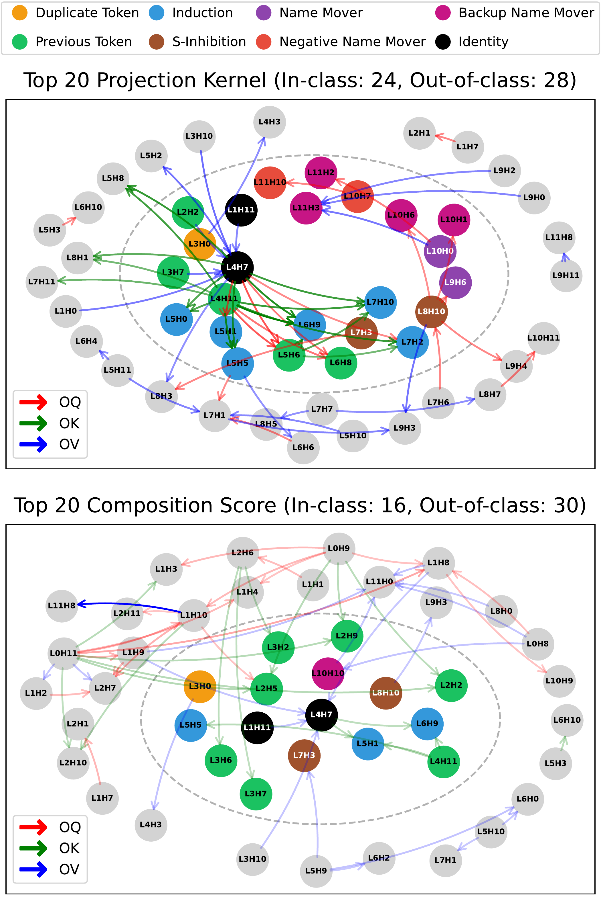

# Measuring Affinity between Attention-Head Weight Subspaces via the Projection Kernel

[Hiroaki Yamagiwa](https://ymgw55.github.io/) $^{1}$, Yusuke Takase $^{1}$, [Hidetoshi Shimodaira](http://stat.sys.i.kyoto-u.ac.jp/members/shimo/) $^{1,2}$

$^{1}$ Kyoto University, $^{2}$ RIKEN AIP

<div align="center">

</div>

## Citation

```
@misc{yamagiwa2026measuringaffinityattentionheadweight,
      title={Measuring Affinity between Attention-Head Weight Subspaces via the Projection Kernel}, 
      author={Hiroaki Yamagiwa and Yusuke Takase and Hidetoshi Shimodaira},
      year={2026},
      eprint={2601.10266},
      archivePrefix={arXiv},
      primaryClass={cs.CL},
      url={https://arxiv.org/abs/2601.10266}, 
}
```